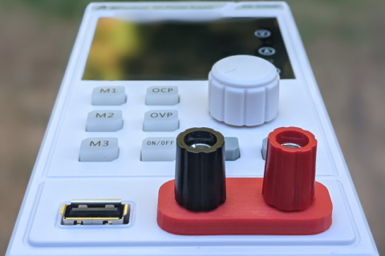

# A-BFastiron SS-305MP USB Board

Board is intended for placement in the A-BFastiron SS-305MP.

Once placed on the inside, it will provide 5 V / 500 mA USB output.

Before plugging ANYTHING in, do measure USB voltage. If you measure 7 V, you
probably mounted voltage regulator in reverse.

See also:
* [Parts](Board/ABfastiron-Usb.md)
* [Blog post](https://www.medo64.com/2021/07/adding-usb-to-a-bfastiron-ss-305mp/)
* [Repository](https://github.com/medo64/ABfastiron-Usb)

